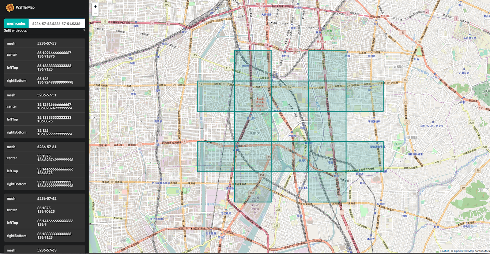

# waffle-map

[](https://greenkeeper.io/)

> Fantastic mesh renderer

[](https://travis-ci.org/dorayakikun/waffle-map)
[](https://codeclimate.com/github/dorayakikun/waffle-map)
[](https://codeclimate.com/github/dorayakikun/waffle-map/coverage)

Mesh code is a very useful project, but it is not intuitive. Waffle Map generates a mesh from the mesh code and render it on the map. I would be happy if we can help everyone understand the mesh code !!

# [](https://dorayakikun.github.io/waffle-map/)

## Contents

- [Usage](#usage)
- [Extending Waffle Map](#extending-waffle-map)
- [Author](#author)

## Usage

``` console
$ git clone https://github.com/dorayakikun/waffle-map.git
$ npm run dev
```

## Extending Waffle Map

### first step
Prepare below modules

- name: waffle-map-mesh-calculator-{your-logic-name}
- functions:
  - latLngToMesh(lat: number, lng: number, scale: number): string
  - meshToBounds(mesh: string): Bounds
  - meshToLatLng(mesh: string): LatLng
- constant
  - SCALES: [number]
  
Please see [here](https://github.com/dorayakikun/waffle-map-mesh-calculator-basic) as sample code.

### second step

Append wafflemap config in package.json.

``` json
"wafflemap": {
  "meshcalculator": "your-logic-name"
}
```

## Author
- dorayakikun